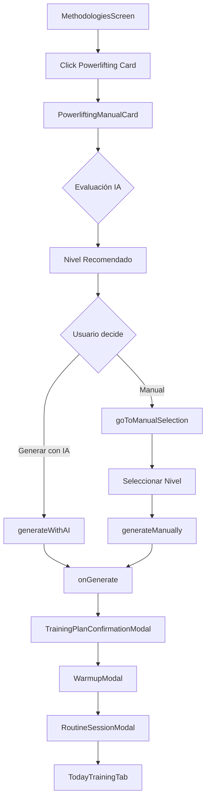

# 🏋️ Powerlifting Module

## Descripción

Módulo completo de metodología **Powerlifting** para la aplicación **Entrena con IA**. Sigue el patrón arquitectónico establecido en Calistenia e Hipertrofia.

## 📁 Estructura de Archivos

```
Powerlifting/
├── PowerliftingManualCard.jsx     ← Componente principal (evaluación IA + selección manual)
├── PowerliftingLevels.js          ← Configuración de niveles (novato, intermedio, avanzado, elite)
├── PowerliftingMuscleGroups.js    ← Movimientos principales + asistencia
└── README.md                       ← Esta documentación
```

## 🎯 Características

### PowerliftingManualCard.jsx
- **Evaluación IA automática** del nivel del usuario
- **Selección manual** de nivel con información detallada
- **Generación de plan** personalizado
- **Reducer pattern** para manejo de estado complejo
- **API endpoints**: `/api/powerlifting-specialist/evaluate-profile`

### PowerliftingLevels.js
**4 Niveles de progresión:**

| Nivel | Experiencia | Frecuencia | Intensidad | Series |
|-------|-------------|------------|------------|--------|
| **Novato** | 0-6 meses | 3 días/sem | 60-75% 1RM | 3-5 series |
| **Intermedio** | 6m-2 años | 4 días/sem | 70-85% 1RM | 4-6 series |
| **Avanzado** | 2-5 años | 4-5 días/sem | 75-90% 1RM | 5-8 series |
| **Elite** | +5 años | 5-6 días/sem | 80-95% 1RM | 6-10 series |

**Funciones principales:**
- `getLevelConfig(levelId)` - Obtener configuración de nivel
- `getLevelRecommendations(level)` - Obtener recomendaciones por nivel
- `canProgressToNextLevel(currentLevel, lifts)` - Validar progresión

### PowerliftingMuscleGroups.js
**5 Grupos de movimientos:**

1. **Sentadilla** (main lift)
   - Variantes: Back squat, front squat, box squat, pause squat
   - Color: red-500

2. **Press de Banca** (main lift)
   - Variantes: Flat bench, close grip, pause bench, floor press
   - Color: orange-500

3. **Peso Muerto** (main lift)
   - Variantes: Conventional, sumo, deficit, block pulls
   - Color: red-600

4. **Asistencia Inferior**
   - Ejercicios: Leg press, lunges, good mornings, leg curls
   - Color: blue-500

5. **Asistencia Superior**
   - Ejercicios: Dips, rows, overhead press, tricep work
   - Color: purple-500

**Funciones principales:**
- `getMuscleGroupInfo(groupId)` - Información de grupo muscular
- `getRecommendedGroupsByLevel(level)` - Grupos recomendados por nivel
- `generateBalancedSplit(level, daysPerWeek)` - Generar split de entrenamiento

## 🔄 Flujo de Usuario



## 🎨 Tema Visual

**Colores principales:**
- Primary: `yellow-400` (consistente con app)
- Powerlifting: `red-600` (fuerza y potencia)
- Success: `green-400`
- Warning: `orange-400`
- Error: `red-400`

**Iconos:**
- Novato: 🔰
- Intermedio: 💪
- Avanzado: 🏋️
- Elite: 👑
- General: 🏋️ (Award component)

## 📡 Integración Backend

### Endpoints necesarios:
```javascript
POST /api/powerlifting-specialist/evaluate-profile
POST /api/powerlifting-specialist/generate-plan
```

### Base de datos:
```sql
app."Ejercicios_Powerlifting"
```

### Prompt especializado:
```
backend/prompts/powerlifting_specialist.md
```

## 🧪 Testing

### Pruebas necesarias:
1. ✅ Evaluación IA devuelve nivel válido
2. ✅ Selección manual genera plan correcto
3. ✅ Validación de progresión de niveles
4. ✅ Generación de splits balanceados
5. ✅ Integración con modales del flujo

### Comando de test:
```bash
npm run test:powerlifting
```

## 🛠️ Uso del Componente

```jsx
import PowerliftingManualCard from './methodologies/Powerlifting/PowerliftingManualCard.jsx';

// En MethodologiesScreen.jsx
const handlePowerliftingGenerate = async (powerliftingData) => {
  await generatePlan({
    ...powerliftingData,
    mode: 'manual',
    methodology: 'powerlifting'
  });
};

<PowerliftingManualCard
  onGenerate={handlePowerliftingGenerate}
  isLoading={plan.status === 'generating'}
  error={plan.error}
/>
```

## 📊 Datos Esperados

### Input (onGenerate):
```javascript
{
  methodology: 'Powerlifting Specialist' | 'Powerlifting Manual',
  source: 'ai_evaluation' | 'manual_selection',
  level: 'novato' | 'intermedio' | 'avanzado' | 'elite',
  confidence: 0.85,  // Solo para IA
  goals: 'Mejorar sentadilla y press de banca',
  selectedMuscleGroups: ['sentadilla', 'press_banca', 'peso_muerto'],
  aiEvaluation: { /* objeto completo */ },
  userProfile: { id: 123 },
  version: '1.0'
}
```

### Output (evaluación IA):
```javascript
{
  success: true,
  evaluation: {
    recommended_level: 'intermedio',
    confidence: 0.85,
    reasoning: 'Basado en tu experiencia...',
    key_indicators: ['1.5x peso en sentadilla', 'Técnica sólida'],
    suggested_focus_areas: ['Sentadilla', 'Press Banca'],
    safety_considerations: ['Calentar correctamente', 'Progresar gradualmente']
  }
}
```

## 🔧 Configuración

### Constantes modificables:
```javascript
// PowerliftingLevels.js
TRAINING_CONSTANTS = {
  WARMUP_DURATION: { novato: 15, intermedio: 20, ... },
  INTENSITY_RANGE: { novato: '60-75% 1RM', ... },
  REST_BETWEEN_SETS: { novato: 180, ... }
}
```

## 🐛 Debugging

### Logs importantes:
```javascript
console.log('🏋️ Iniciando evaluación Powerlifting v1.0...');
console.log('✅ Evaluación Powerlifting completada:', {...});
console.log('🚀 Generando plan Powerlifting con IA especializada...');
```

### Errores comunes:
1. **API endpoint no encontrado**: Verificar redirecciones en `server.js`
2. **Nivel inválido**: Validar que sea uno de los 4 niveles válidos
3. **Tabla no existe**: Verificar `Ejercicios_Powerlifting` en Supabase

## 📚 Referencias

- **Patrón base**: HipertrofiaManualCard.jsx
- **Arquitectura**: CalisteniaManualCard.jsx
- **Validación**: CardValidationUtils
- **API**: backend/routes/routineGeneration.js

## 🚀 Versión

**v1.0.0** - Implementación inicial completa

## 👥 Autor

Claude Code - Arquitectura Modular Profesional

---

**Última actualización**: 2025-10-10
